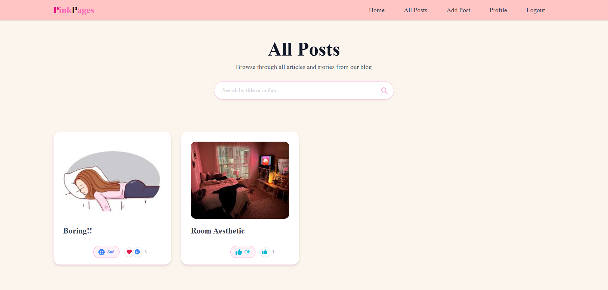
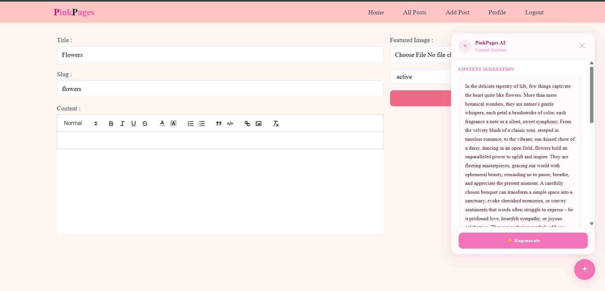

# 🌸 PinkPages

A modern, full-stack blog platform built with the MERN stack and Appwrite — where every story finds its bloom.

🔗 **Live Demo**: [pink-pages-gp9p5rlvl-divya-s-projects3.vercel.app](https://pink-pages-gp9p5rlvl-divya-s-projects3.vercel.app/)

---

## ✨ Features

- **Authentication** — Secure sign up, login, and logout using Appwrite Auth
- **Create & Edit Posts** — Rich text editor (Quill) with featured image upload
- **AI Content Assistant** — Floating AI assistant powered by Google Gemini via Appwrite Functions that suggests blog content and section ideas based on your post title
- **Reactions** — React to posts with emoji-based reactions (love, haha, wow, sad, clap, and more)
- **Comments & Replies** — Nested comment system with reply support
- **Author Profiles** — Public profile pages showing all posts by an author
- **Protected Routes** — Auth-guarded pages using Redux state management
- **Toast Notifications** — Real-time feedback on all user actions via react-hot-toast
- **Responsive Design** — Mobile-friendly layout with a soft, feminine pastel pink aesthetic

---

## 🛠️ Tech Stack

| Layer              | Technology                                    |
| ------------------ | --------------------------------------------- |
| Frontend           | React 18, Vite, Tailwind CSS                  |
| State Management   | Redux Toolkit                                 |
| Backend & Database | Appwrite (Auth, Database, Storage, Functions) |
| Rich Text Editor   | React Quill                                   |
| AI Integration     | Google Gemini API via Appwrite Functions      |
| Forms              | React Hook Form                               |
| Routing            | React Router DOM v6                           |
| Notifications      | react-hot-toast                               |
| Deployment         | Vercel                                        |

---

## 🚀 Getting Started

### Prerequisites

- Node.js 18+
- An [Appwrite](https://appwrite.io) account
- A [Google AI Studio](https://aistudio.google.com) API key (for AI assistant)

### Installation

```bash
# Clone the repository
git clone https://github.com/Divyahub7/PinkPages.git

# Navigate to the project
cd PinkPages

# Install dependencies
npm install

# Start the development server
npm run dev
```

### Environment Setup

Create a `.env` file in the root directory:

```env
VITE_APPWRITE_URL=your_appwrite_endpoint
VITE_APPWRITE_PROJECT_ID=your_project_id
VITE_APPWRITE_DATABASE_ID=your_database_id
VITE_APPWRITE_TABLE_ID=your_posts_collection_id
VITE_APPWRITE_BUCKET_ID=your_storage_bucket_id
VITE_APPWRITE_PROFILES_COLLECTION_ID=your_profiles_collection_id
VITE_APPWRITE_REACTIONS_COLLECTION_ID=your_reactions_collection_id
VITE_APPWRITE_COMMENTS_COLLECTION_ID=your_comments_collection_id
```

---

## 🤖 AI Assistant Setup

The AI content assistant runs as an Appwrite Function using the Google Gemini API.

1. Create a Node.js 18 function in Appwrite Console
2. Add `GEMINI_API_KEY` as an environment variable in the function settings
3. Deploy the function from the `/ai-suggest` folder
4. The assistant suggests 200-word content drafts and section ideas based on your post title

---

## 📸 Screenshots

### Home Page


### Blog Post



### AI Assistant



---

## 👩‍💻 Author

**Divya** — [@Divyahub7](https://github.com/Divyahub7)
